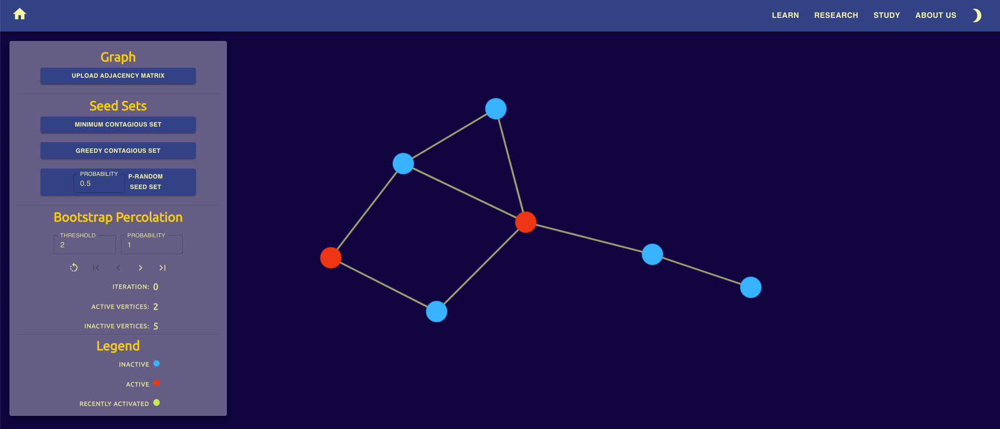

# Booper
Booper is a web application that can help users visualize graphs and bootstrap percolation. Despite extensive searching, we could not find any other web applications for visualizing bootstrap percolation. We created Booper to address this lack of availability. This web application can help scholars research bootstrap percolation more efficiently, and it can be beneficial to the field in the long run.

Booper displays any graph and seed set that the user chooses. These parameters can be specified by uploading a file. Then, the user can visualize the percolation, either by stepping through the iterations, or by skipping to the final result. If the user chooses to step through the iterations, then Booper highlights the vertices that were just infected, and it summarizes the state of the process, showing how many vertices are active, how many are inactive, and how many iterations have occured. If the user chooses to skip to the end, then they can still see the summary of the end state.

Additionally, our application offers users the opportunity to find contagious sets. We provide two algorithms that find contagious sets. One guarantees a minimum contagious set, but it can be slow for large graphs (the minimum contagious set is an NP-hard problem). The other is greedy; it generates a contagious set much faster, but it might not be optimal. There is also an option to generate random seed sets, in which each vertex is included independently at random with a given probability. Users can activate all three of these algorithms with a click of a button, display the resulting seed sets, and then percolate on them.



## Usage

### Production
The production build for Booper is available [here](https://thaumic.dev/bp/). The visualization tool is under the **Study** tab. Everything you need to know about how to use this tool is explained in a product tour that automatically opens when you visit **Study**.

### Development
To install the dependencies, open a terminal, navigate to the home directory of this project, and run
```bash
npm ci
```
Run this command when you clone this repository and every time you add/remove a package or switch branches.

To open Booper in a development environment, all dependencies must be installed. Then, run
```bash
npm start
```
Booper will automatically open in your default browser. Alternatively, you can visit localhost:3000/bp/.

To use the **Minimum Contagious Set** and **Greedy Contagious Set** buttons, you need to enable Cross-Origin Resource Sharing (CORS) by using [Moesif Origin & CORS Changer](https://chrome.google.com/webstore/detail/moesif-origin-cors-change/digfbfaphojjndkpccljibejjbppifbc?hl=en-US) or something similar. For security reasons, we recommend disabling CORS when you are not using Booper. Enabling CORS is only necessary in the development environment, not in production.

## Architecture

### React.js
Booper is built with [React.js](https://reactjs.org/), a popular framework for interactive websites.

### D3.js
[D3.js](https://d3js.org/) is a library for rendering graphics. It has very broad use cases. For Booper, we use its npm package [react-force-graph-2d](https://www.npmjs.com/package/react-force-graph-2d) to display graphs. This package uses a force-directed graph drawing algorithm to display graphs in an aesthetically pleasing way. Every vertex has a velocity and is affected by forces, like in Newtonian physics. The forces push and pull vertices around such that adjacent vertices are usually close together, and edges usually do not cross. Detailed descriptions of the available forces can be found [here](https://github.com/d3/d3-force). We use a subset of the available forces and modifies their strengths from the default.

### Material-UI
[Material-UI](https://material-ui.com/) is a popular library for making pretty UIs. It provides pretty versions of many standard components, such as buttons and text fields. For Booper, we use Material-UI's npm package [@material-ui/core](https://www.npmjs.com/package/@material-ui/core) and [@material-ui/icons](https://www.npmjs.com/package/@material-ui/icons). We abstracted Booper's theme in the file src/utils/theme.js, and we pass this theme object to material-UI components, determining how to style these components.

### Web Server
Some of the computations that Booper performs are too expensive for web browsers to handle. We set up a server to perform the algorithms for finding contagious sets. When a user clicks either the **Minimum Contagious Set** or **Greedy Contagious Set** button, Booper sends an HTTP request to the server, with a JSON representation of the graph and the threshold as arguments. Then, the server computes the requested contagious set and sends the result back to Booper in the response object.

## License

Copyright (C) 2020-2021 Connor Anderson <<canderson@thaumavor.io>>, Akshaj
Balasubramanian <<bakshaj99@gmail.com>>, Henry Poskanzer
<<hposkanzer@gmail.com>>

Booper is licensed under the GPL v3 or later. See LICENSE for the full license
text.
